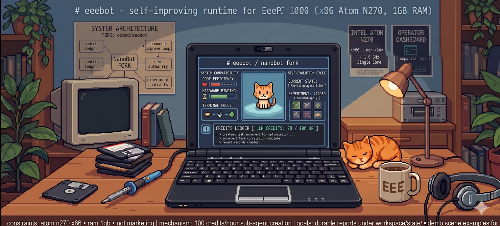

# eeebot

This repository is the canonical `eeebot` project for the eeepc self-improving runtime and its operator-facing control/dashboard workflow.

Important compatibility note:
- the repository/project name is now `eeebot`
- the internal Python package, CLI, and many runtime paths still use `nanobot` for compatibility with the existing deployed system, dashboard, and eeepc host
- the package now exposes both CLI entrypoints during the compatibility window:
  - `nanobot`
  - `eeebot`
- renaming the package/runtime internals should be treated as a separate migration, not mixed into the GitHub repo rename

It is not a plain mirror of the upstream `HKUDS/nanobot` repository.
It contains fork-specific work for:
- bounded self-improving runtime slices
- eeepc live authority integration
- HADI + WSJF hypothesis/prioritization surfaces
- experiment contracts, outcomes, frontier tracking, credits, and revert records
- local operator dashboard integration and proof-oriented docs

GitHub repositories:
- Canonical main project repo: https://github.com/ozand/eeebot
- Temporary/staging dashboard repo: https://github.com/ozand/eeebot-ops-dashboard
  - This sibling repo is not the durable source of truth for product work.
  - Dashboard/operator-control code should be imported or mirrored into `ozand/eeebot`; see `docs/EEEBOT_CANONICAL_REPOSITORY_AND_DASHBOARD_CONSOLIDATION.md`.
- Upstream source project: https://github.com/HKUDS/nanobot

## What this fork is for

This fork is focused on making Nanobot operationally useful for a real bounded self-improvement loop on `eeepc`, not just preserving upstream defaults.

Key fork-specific capabilities include:
- live authority reads from eeepc control-plane state
- durable self-evolving cycle reports under `workspace/state/`
- approval-gated bounded apply behavior
- promotion/write-path/read-path convergence notes and proofs
- HADI hypothesis backlog with explicit WSJF surface
- experiment contracts with `keep` / `discard` / `crash` / `blocked`
- credits ledger and durable subagent/task correlation

## Canonical docs to start with

Top-level docs index:
- `docs/README.md`

Core operating docs:
- `docs/EEEBOT_SELF_IMPROVING_RUNTIME_OPERATING_CONTRACT.md`
- `docs/EEEBOT_BUDGET_AND_REWARD_MODEL.md`
- `docs/EEEBOT_EXPERIMENT_AND_OUTCOME_CONTRACT.md`
- `docs/EEEBOT_OPERATOR_WORKFLOW.md`

Migration docs:
- `docs/EEEBOT_INTERNAL_RENAME_MIGRATION_PLAN.md`
- `docs/EEEBOT_PHASE2_RENAME_MATRIX.md`
- `docs/EEEBOT_MIGRATION_STATUS_AND_PROOF.md`

Execution/proof docs:
- `docs/NANOBOT_COMPLETION_CONTRACT.md`
- `docs/NANOBOT_FINAL_COMPLETION_SUMMARY.md`
- `docs/EEEPC_RUNTIME_STATE_AUTHORITY_USAGE.md`
- `docs/EEEPC_RUNTIME_STATE_AUTHORITY_LIVE_VERIFICATION_2026-04-16.md`
- `docs/EEEPC_AGENT_RUNTIME_INSTRUCTIONS.md`

## Upstream relationship

We still track upstream `HKUDS/nanobot`, but we do not blindly merge everything.

Merge policy for this fork:
- take safe, high-value upstream fixes selectively
- avoid merges that would break the eeepc 32-bit/runtime constraints
- preserve fork-specific bounded self-improvement behavior and operator surfaces

Examples of upstream updates that are good candidates:
- session durability and corruption repair
- safe subagent/session routing fixes
- narrowly-scoped agent reliability improvements

Examples that require extra scrutiny before merge:
- packaging/layout changes
- provider/model defaults
- heavy WebUI or channel changes
- features that assume environments unavailable on eeepc

## Current state

This repo should be understood as:
- a maintained operational eeebot repository
- still carrying `nanobot` compatibility internally in code/runtime names
- not a vanilla upstream checkout
- not a marketing landing page

## Local repo-side self-improving cycle

The local repo-side workspace runtime can be driven by the user systemd timer:
- `systemd/eeebot-local-cycle.service`
- `systemd/eeebot-local-cycle.timer`

Install locally with:
- `./scripts/install_user_units.sh`
- create `~/.config/eeebot-self-improving.env`
- `systemctl --user enable --now eeebot-local-cycle.timer`

Recommended env values:
- `NANOBOT_WORKSPACE=/home/ozand/herkoot/Projects/nanobot/workspace`
- `NANOBOT_RUNTIME_STATE_SOURCE=workspace_state`
- optional `NANOBOT_SELF_EVOLVING_TASKS=...`
- optional `NANOBOT_LOCAL_APPROVAL_TTL_SECONDS=900`
- optional `NANOBOT_RUNTIME_ROOT=/home/ozand/herkoot/Projects/nanobot/workspace/state/self_evolution/runtime/current`

The local approval keeper is also available:
- `systemd/eeebot-local-approval-keeper.service`
- `systemd/eeebot-local-approval-keeper.timer`

The guarded self-evolution loop is the default managed autonomous path on this host:
- `systemd/eeebot-guarded-evolution.service`
- `systemd/eeebot-guarded-evolution.timer`
- `scripts/create_candidate_release.py`
- `scripts/health_check_release.py`
- `scripts/guarded_self_evolve.py`
- `scripts/commit_and_push_self_evolution.py`

This guarded path creates a self-mutation request, commits/pushes tracked source changes, creates a candidate release from the current git commit, applies it through a release directory/current symlink, runs an automatic health gate, and writes rollback/failure-learning artifacts if the gate fails.

Recommended guarded-evolution env values:
- `NANOBOT_AUTOEVO_WAIT_SECONDS=300`
- `NANOBOT_AUTOEVO_MAX_REPORT_AGE_SECONDS=600`
- `NANOBOT_REPO_ROOT=/home/ozand/herkoot/Projects/nanobot`
- `NANOBOT_WORKSPACE=/home/ozand/herkoot/Projects/nanobot/workspace`
- `NANOBOT_AUTOEVO_REMOTE_NAME=selfevo` (recommended publish target for separate self-evolving host repo)
- `NANOBOT_AUTOEVO_REMOTE_BRANCH=main`
- `NANOBOT_AUTOEVO_SOURCE_REMOTE_NAME=origin`
- `NANOBOT_AUTOEVO_SOURCE_REMOTE_BRANCH=main`
- `NANOBOT_AUTOEVO_ALLOWED_REPO=ozand/eeebot-self-evolving`
- optional `NANOBOT_SELFEVO_GITHUB_TOKEN=...` for a dedicated repo-scoped publish credential
- optional `NANOBOT_RUNTIME_ROOT=/home/ozand/herkoot/Projects/nanobot/workspace/state/self_evolution/runtime/current/source`
- `NANOBOT_INSTALL_GUARDED_EVOLUTION=1` during install to enable the guarded timer automatically

This is intentionally local-only for the repo-side workspace runtime on this host.
It should not be confused with the operator-controlled eeepc live approval workflow.

For current runtime and dashboard state, see the fork docs and the separate dashboard repo.
